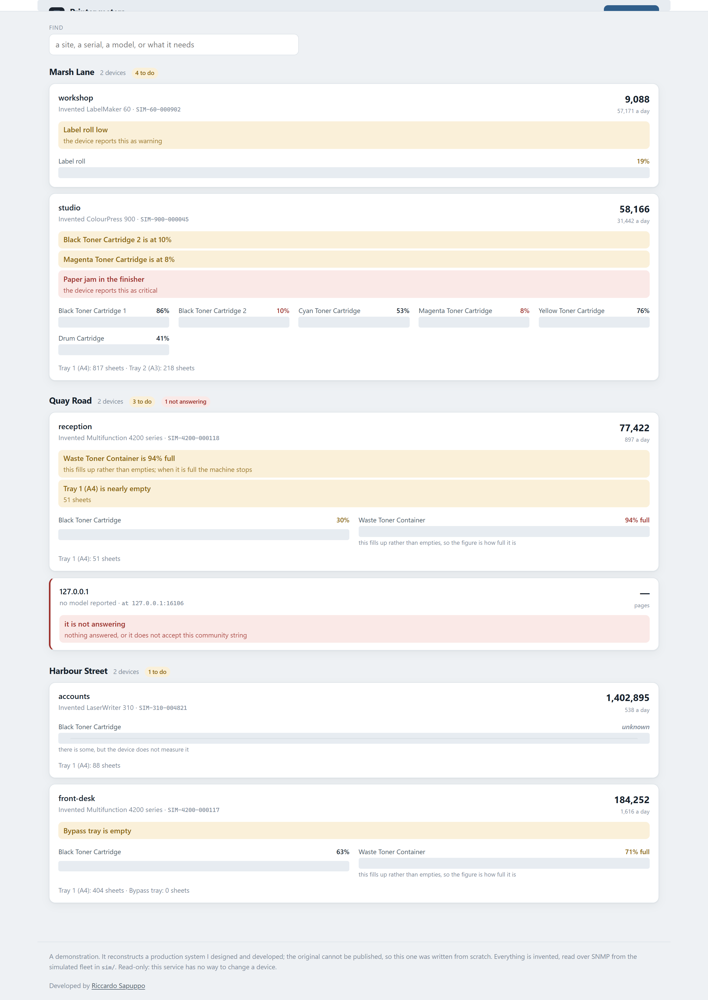
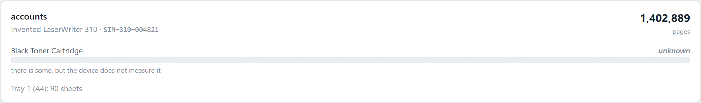
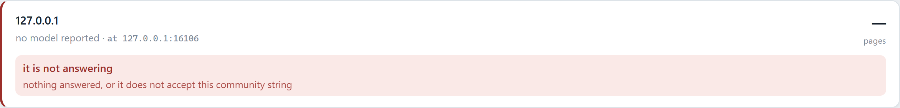
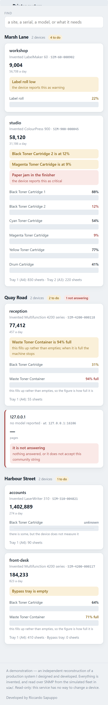

# Printer meter collector

Reads page counters and consumable levels from networked printers over SNMP,
keeps the history, and puts what needs doing on a board somebody can glance at.

**Read-only.** There is no `set` anywhere in this service and nowhere to add one
without noticing. It reads meters; it cannot change a device.



## The two decisions worth arguing about

### 1. The open standard, not a manufacturer's own interface

Everything this reads is defined in an open IETF standard — the
**Printer MIB (RFC 3805)**, the Host Resources MIB (RFC 2790) and SNMPv2-MIB
(RFC 3418). Nothing comes from a vendor's private branch and nothing drives a
device's admin web page.

The service this was rebuilt from did the second: it logged into a printer's
embedded web interface with a browser, clicked through the menus, and read the
toner level by **measuring the width of a coloured bar**. That number is an
inference from a CSS pixel width. `prtMarkerSuppliesLevel` is the device saying
the number itself.

The standard is also what makes it useful across a fleet, which is never one
make. A collector written against one manufacturer's own numbers has to be
rewritten for the next purchase.

### 2. Three states, not two

A supply is not always a number. Sometimes the device says it cannot measure,
and RFC 3805 has values that say exactly that: −1, −2, −3.

Dividing one of those by the maximum gives a confident percentage that is a lie.
Clamped to zero it becomes an empty bar, which looks exactly like a machine
about to stop — so a cartridge is ordered and an engineer sent for a printer
that is perfectly full.

So "unknown" is drawn as itself: hatched, full width, and labelled in words.



The other two that catch people, both in the sample fleet because both are in
every real one: a **waste container fills** rather than empties, so 90 means
nearly unusable and not nearly new; and a supply reported **in sheets** is not a
percentage, so 430 labels is not 430%.

## Before you start

- **Node 20.11 or newer.** Declared in `engines` and pinned in CI.
- **One runtime dependency**, Express, for the board. The SNMP client is written
  here, in `src/snmp/`.
- **No hardware.** `npm run fleet` starts six invented printers on localhost
  that answer real SNMP.
- **No database.** Readings are append-only lines of JSON in `data/`.
- **Docker, only for one check.** `npm run check:snmp` puts the codec against a
  real `net-snmp` agent. Everything else runs without it.
- **To undo it:** delete the folder. Nothing is written outside it.

## Running it

Two terminals, because they are two things: some printers, and something that
reads them.

```
npm install

npm run fleet     # six invented printers on 127.0.0.1:16101-16106
npm start         # the collector and the board, on http://127.0.0.1:3500
```

Point it at real devices by editing [`config/fleet.json`](config/fleet.json).
The file is **re-read every round**, so a printer can be added without a
restart.

```json
{ "devices": [{ "host": "192.168.1.40", "site": "Harbour Street", "community": "public" }] }
```

**3500, not 3000.** That is the port every project on a machine uses in turn,
and a browser remembers service workers, storage and permissions per origin — so
two projects sharing a port share state neither knows about.

## The six invented printers

Every device, site, serial and page count in `sim/` is made up. They are shaped
to be awkward in the ways real fleets are, because a collector that only ever
meets tidy devices has never been tested.

| | why it is there |
|---|---|
| `front-desk` | ordinary, with a waste container that fills |
| `accounts` | **cannot measure its toner**, and says so with −2 |
| `studio` | **two black cartridges**, so code assuming one row per colour reports half the toner it has; and a paper jam |
| `workshop` | supplies **in sheets**, not percent |
| `reception` | a waste container nearly full, and a tray nearly empty |
| `stores` | **nothing is listening**, because a fleet always has one machine off |

That last one is not decoration. A device that has never answered has no serial,
so it has no history, so it is not on the board, so nobody knows it is down — and
that is the failure a fleet report must not have. It is filed under its address
instead, marked provisional:



## What it does, and what it will not do

```
GET  /api/health           what it is, and what it has collected
GET  /api/devices          every device, grouped by site, with what it needs
GET  /api/devices/:serial  one device, and its history
POST /api/round            collect now rather than at the next tick
POST /api/discover         sweep a range for anything that answers SNMP
```

The sweep **refuses anything outside the private address ranges** unless the
caller passes `allowPublic`, and refuses anything wider than a /16. Sweeping a
range on a network you administer is ordinary network management; on somebody
else's it is not, and nobody should do the second by leaving a field blank.

There is no authentication, and this says so rather than looking protected while
being open. It binds to localhost and belongs behind whatever a deployment
already has.

**SNMP v2c is a community string in clear text and it is not authentication.**
It is what office printers speak. The answer for anything that matters is v3,
which most of these devices do not have; pretending otherwise would be worse
than saying it.

## On a phone

<p>
  
</p>

## Checking it

```
npm test                # 49 assertions over the parts
npm run check:snmp      # the codec against an agent nobody here wrote
npm run walkthrough     # 28 over HTTP against the running collector
npm run check:screen    # drives the board with a browser
npm run check:mark      # the header mark and the tab icon are one drawing
```

Four layers, and each one has caught something the others could not.

**`npm test`** covers the encoding, the normalisation and the scheduler. The BER
tests check against byte sequences written down from the standard, not against
this project's own encoder — a codec tested by encoding and decoding its own
output agrees with itself about everything, including what it gets wrong.

**`npm run check:snmp`** is the other half of that, and it is the check that
keeps the rest honest:

```
docker run -d --rm --name snmp-probe -p 16200:161/udp polinux/snmpd
npm run check:snmp
docker stop snmp-probe
```

The simulator in `sim/` is built on the same encoder the client decodes with, so
anything they both get wrong they will agree about. `net-snmp` has been in the
field for twenty-five years and has no interest in agreeing with this. Two of
the fifteen assertions are chosen for where hand-rolled codecs break: eight
objects in one request, which puts the reply's outer length over 127 bytes; and
a walk of more than nine rows, which is where an OID sorted as a string stops
matching one sorted as numbers.

Without a container it exits 2 and says how to start one. A check that could not
run is not a check that failed.

**`npm run walkthrough`** drives the running collector. Half of it is about the
readings that are easy to get wrong — the unmeasurable toner, the waste
container, the sheets, the two black cartridges — and half about the device that
is switched off still being in the report.

**`npm run check:screen`** found something neither of the others could. The API
was returning all six devices correctly and the board drew **one site out of
three** and stopped, because a device that never answered has no `pages` key and
`=== null` does not catch `undefined`. Nothing threw where a test could see it;
the report simply lost two thirds of the fleet. So the assertion it exists for is
the boring one: what is on the screen is counted against what the API said.

## Where things are

```
src/
  snmp/
    ber.js         ASN.1 BER, by hand: the encoding SNMP is written in
    client.js      get, get-next and walk over UDP. Read-only
    oids.js        the objects it reads, and which RFC defines each
  fleet/
    read.js        one device, turned into something comparable across makes
    store.js       append-only history, filed by serial and never by address
    schedule.js    going round without falling over one dead machine
    discover.js    a sweep, bounded to private ranges
  http/api.js      what it will tell you, and what needs doing
sim/               six invented printers that answer real SNMP
public/            the board: no framework, no build step
tools/             the checks not written behind the same door
```

## What this is not

- **Readings are in a file.** Append-only lines of JSON, loaded at startup: a
  few hundred thousand readings, not a few hundred million. A real deployment
  puts those lines in PostgreSQL or a time-series store and keeps this
  interface, which is four functions and says nothing about files.
- **No SNMP v3.** Adding it means USM, engine discovery, and key localisation,
  which is a project of its own and not what these devices speak.
- **No traps.** This asks; it does not listen. A device that wants to report a
  jam the moment it happens needs the other half.
- **Nothing is written to a device, ever.** Not a limitation — the point.

## A note on manufacturers

This reads the **standard** Printer MIB, which every networked office printer
implements. It is not written for, tested against, endorsed by, or affiliated
with any manufacturer, and it contains no vendor firmware, interface, private
MIB or branding. Every device in `sim/` is invented.

## Licence

MIT. See [LICENSE](LICENSE).

Developed by Riccardo Sapuppo.
